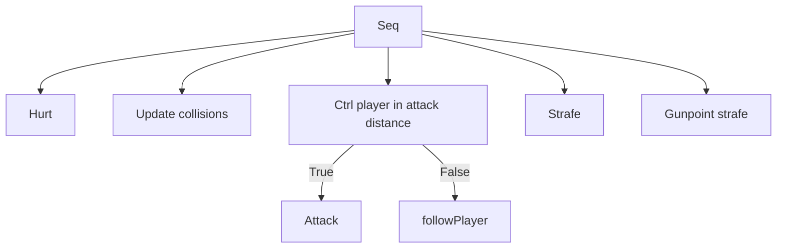
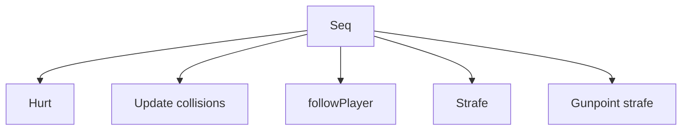
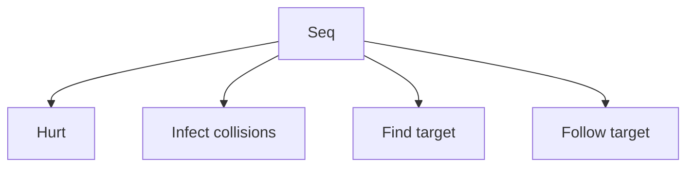

Basic enemy

```mermaid
flowchart TD
    B[Seq]
    B --> Hurt
    B --> U[Update collisions]
    B --> A[Ctrl player in attack distance]
    A --True--> Attack
    A --False--> followPlayer

    B --> Strafe

    B --> C[Gunpoint strafe]
```

Kamikaze

```mermaid
flowchart TD
    B[Seq]
    B --> Hurt
    B --> U[Update collisions]
    B --> followPlayer

    B --> Strafe

    B --> C[Gunpoint strafe]
```

Parasite

```mermaid
flowchart TD
    B[Seq]
    B --> Hurt
    B --> U[Infect collisions]
    B --> F[Find target]
    B --> F1[Follow target]
```
